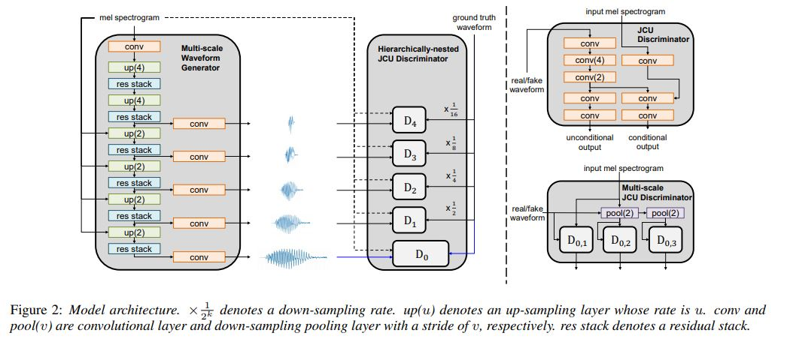

# Modified VocGAN
This repo implements modified version of [VocGAN: A High-Fidelity Real-time Vocoder with a Hierarchically-nested Adversarial Network](https://arxiv.org/abs/2007.15256) using Pytorch, for actual VocGAN checkout to `baseline` branch. I bit modify the VocGAN's generator and used Full-Band MelGAN's discriminator instead of VocGAN's discriminator, as in my research I found MelGAN's discriminator is very fast while training and enough powerful to train Generator to produce high fidelity voice whereas VocGAN Hierarchically-nested JCU dicriminator is quite huge and extremely slows the training process.



Tested on Python 3.6
```bash
pip install -r requirements.txt
```

## Prepare Dataset

- Download dataset for training. This can be any wav files with sample rate 22050Hz. (e.g. LJSpeech was used in paper)
- preprocess: `python preprocess.py -c config/default.yaml -d [data's root path]`
- Edit configuration `yaml` file

## Train & Tensorboard

- `python trainer.py -c [config yaml file] -n [name of the run]`
  - `cp config/default.yaml config/config.yaml` and then edit `config.yaml`
  - Write down the root path of train/validation files to 2nd/3rd line.
  
- `tensorboard --logdir logs/`

## Notes
1) This repo implements modified VocGAN for faster training although for true VocGAN implementation please checkout `baseline` branch, In my testing I am available to generate High-Fidelity audio in real time from Modified VocGAN.
2) Traning cost for `baseline` VocGAN's `Discriminator` is too high (2.8 sec/it on P100 with batch size 16) as compared to `Generator` (7.2 it/sec on P100 with batch size 16), so it's unfeasible for me to train this model for long time.
3) May be we can optimizer `baseline` VocGAN's Discriminator by downsampling the audio on pre-processing stage instead of Training stage (currently I used `torchaudio.transform.Resample` as layer for downsampling the audio), this step might be speed-up overall `Discriminator` training.
4) I trained `baseline` model for 300 epochs (with batch size 16) on LJSpeech, and quality of generated audio is similar to the MelGAN at same epoch on same dataset. Author recommend to train model till 3000 epochs which is not feasible at current training speed `(2.80 sec/it)`.
5) I am open for any suggestion and modification on this repo.

## Inference

- `python inference.py -p [checkpoint path] -i [input mel path]`


## Pretrained models
Two pretrained model are provided. Both pretrained models are trained using modified-VocGAN structure.
* [LJSpeech-1.1](https://keithito.com/LJ-Speech-Dataset/)  (English, single-female speaker, trained for 4000 epochs) \[ [download](https://drive.google.com/file/d/1YCXTbPtVQ3aev7KsL0Cv0kZguEMKZuQp/view?usp=sharing) \]
* [KSS dataset](https://www.kaggle.com/bryanpark/korean-single-speaker-speech-dataset)  (Korean, single-female speaker, trained for 4500 epochs) \[ [download](https://drive.google.com/file/d/1RIqMyj9vSCcGaRgAKrVB5Duvw22N6IXJ/view?usp=sharing) \]

## Audio Samples
Using pretrained models, we can reconstruct audio samples. Visit [here](https://drive.google.com/drive/folders/1QRS9BOQeOXV1aJHdz0ccoKzgfXJFbIKm?usp=sharing) to listen.


## Results
[WIP]

## References
- [VocGAN](https://arxiv.org/abs/2007.15256)
- [Multi-band MelGAN](https://arxiv.org/abs/2005.05106)
- [MelGAN](https://arxiv.org/abs/1910.06711)
- [Pytorch implementation of melgan](https://github.com/seungwonpark/melgan)
- [Official implementation of melgan](https://github.com/descriptinc/melgan-neurips)
- [Multi, Full-band melgan implementation](https://github.com/rishikksh20/melgan)
- [Nvidia's pre-processing](https://github.com/NVIDIA/tacotron2)
- [WaveRNN](https://github.com/fatchord/WaveRNN)

